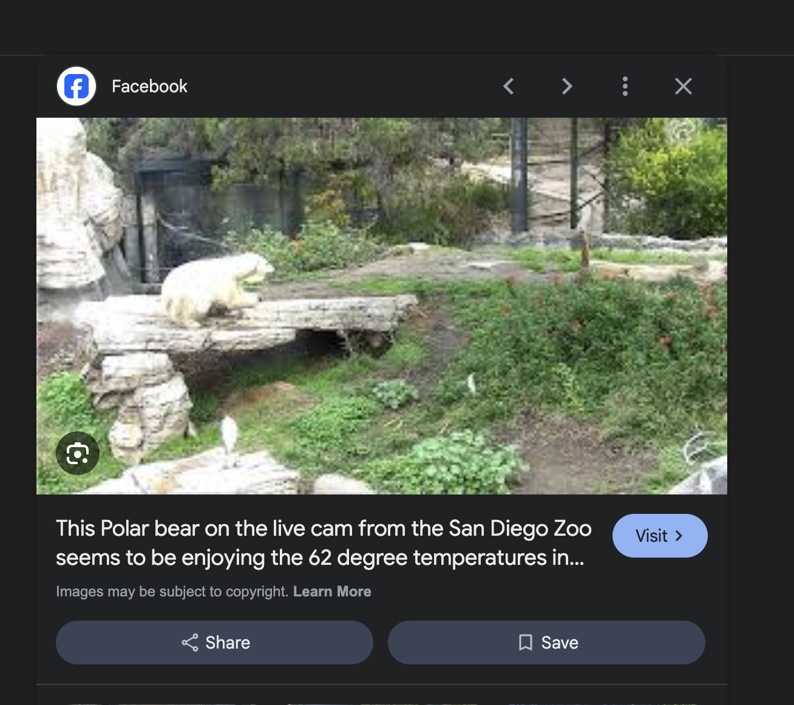
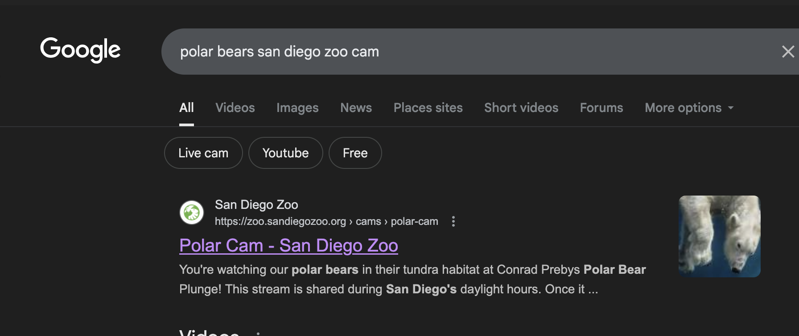
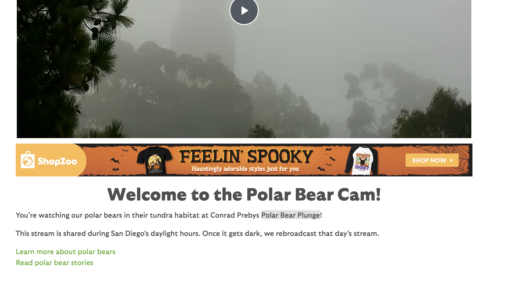
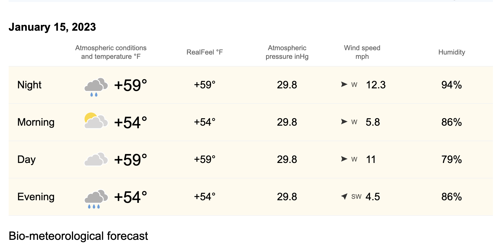

# OSINT Walkthrough – Polar Bear Live Cam

---

## Credits  

This walkthrough is based on **OSINT Exercise #005** by [Gralhix](https://gralhix.com/list-of-osint-exercises/osint-exercise-005/).  
All credit for creating the original challenge goes to the author.  

---

## Challenge  

> “The image below is a screenshot from a zoo live cam. It was taken on January 15, 2023 at around 2pm local time. Please answer the questions below:  
>   
> a) In which zoo are these polar bears located?  
> b) What was the temperature at the time of the screenshot?  
> c) What were the exact coordinates of where the bears were lying down?”  

---

## First Thoughts  

The given clue was that this is a screenshot from a zoo live cam. That means the image should be traceable online through either the zoo’s website, social media, or third-party shares.  
At first glance, the picture itself didn’t reveal many obvious landmarks. So I decided to begin with an **image reverse search**.  

---

## Investigation  

### 1. Image Reverse Search  
I uploaded the screenshot to Google Images and added the keyword *“live cam”*. Almost immediately, a Facebook post appeared showing very similar polar bear images, even with some notes about temperature. This looked promising but I wanted to verify further.  

I then searched for *“polar bears San Diego Zoo cam”* and quickly reached the **official live cam site**.  

---

### 2. Location Verification  
I switched to **Google Earth Pro** to check the enclosure. At first, the area was too large and I couldn’t spot the exact place. Returning to the official site, I noticed the enclosure was named **“Polar Bear Plunge”**.  

Searching again with this keyword helped me locate the right area. Dropping the yellow Street View figure and checking historical views (including 2023) confirmed that the structural details in the enclosure matched the screenshot.  

From here, I was able to extract the exact coordinates.  

**Coordinates found:** `32.734456, -117.154589`  

---

### 3. Temperature Check  
Since I had the **date, time, and location**, I looked up historical weather data.  
Using [World Weather Info](https://world-weather.info/), I navigated to **January 15, 2023** in San Diego. The report listed the temperature in Fahrenheit.  

**Temperature found:** ~54°F  

---

## Final Answers  

- **A:** San Diego Zoo  
- **B:** Approximately 54°F  
- **C:** `32.734456, -117.154589`  

---

## Tools Used  

- Google Images (reverse search)  
- Google Earth Pro + Street View  
- World Weather Info  
- Official San Diego Zoo Live Cam site  

---
